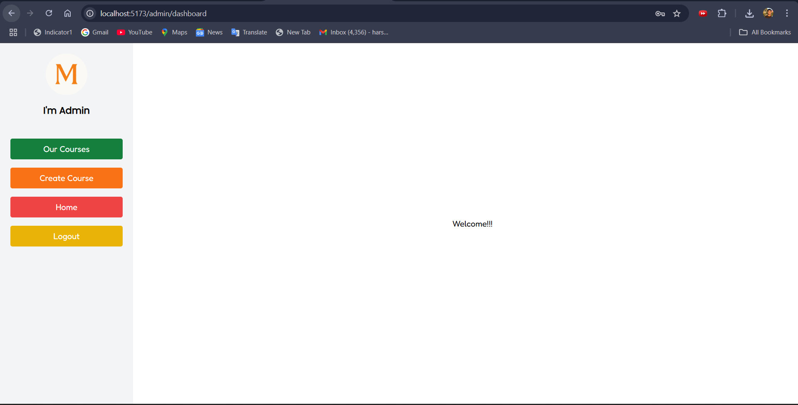
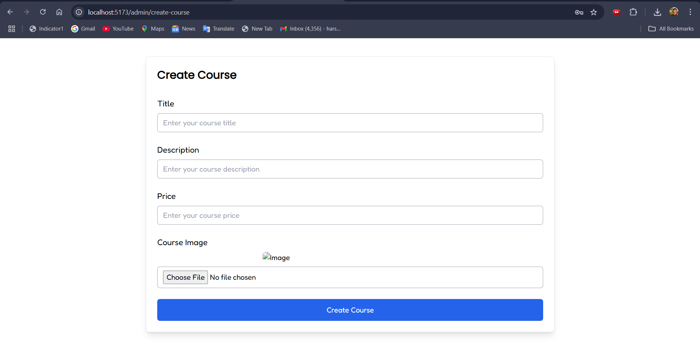
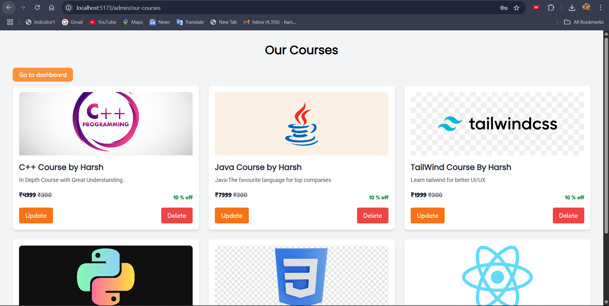
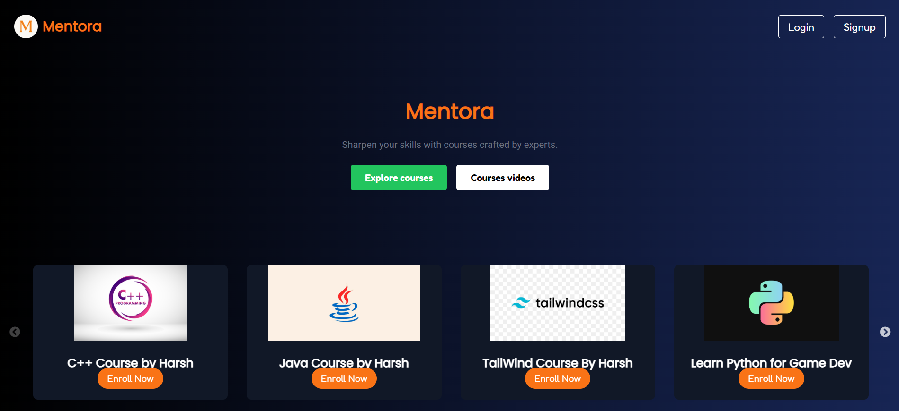
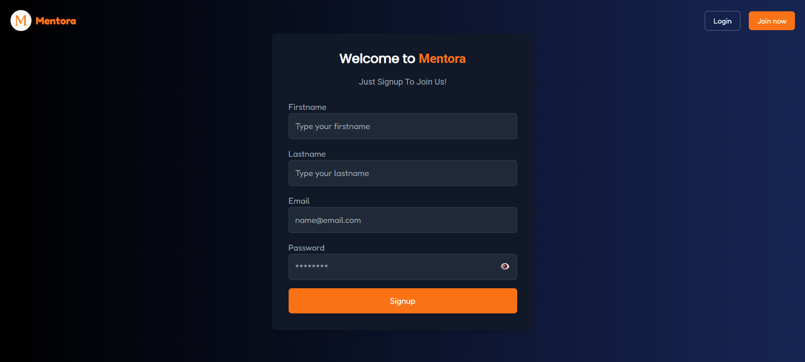
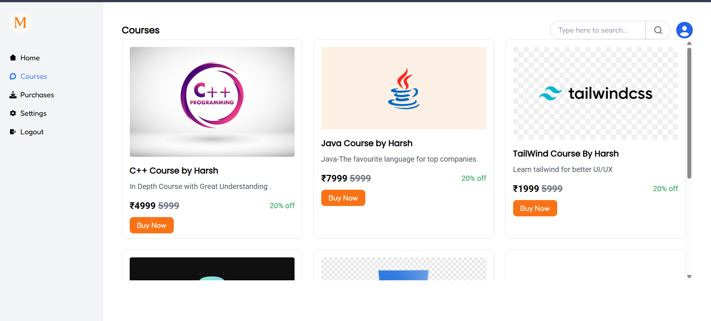
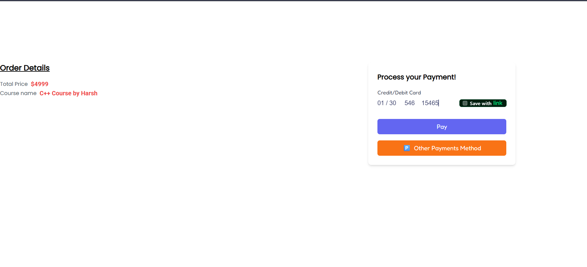

Mentora 🎓

*A Full-Stack Course Selling Platform*

Mentora is a **full-stack course selling web application** built using the **MERN stack (MongoDB, Express.js, React, Node.js)**. It provides a secure and scalable platform for **admins** to manage courses and **users** to purchase them using **Stripe integration**.

---

## 🚀 Features

### 👨‍🏫 Admin

* Add new courses with **title, description, price, and media**.
* Update and delete their own courses only (ownership validation implemented).
* Manage course data securely with role-based access.

### 👤 Users

* Sign up / Log in securely with **bcrypt password hashing**.
* Browse available courses.
* Purchase courses via **Stripe payment gateway**.
* View purchased courses in their dashboard.

### 🔐 Security & Access

* Separate routes for **admins** and **users** to ensure safe access.
* **JWT authentication** for secure login sessions.
* **Cookie-based sessions** for better handling.

---

## 🛠️ Tech Stack

### Frontend

* **React + Vite** (fast and modern frontend tooling)
* **Tailwind CSS** for responsive UI design

### Backend

* **Node.js** with **Express.js** for REST APIs
* **MongoDB** + **Mongoose** for database management

### Additional Libraries & Tools

* **bcrypt** → Password hashing
* **jsonwebtoken (JWT)** → Authentication
* **stripe** → Payment integration
* **cloudinary** → Media storage (if used for course thumbnails/media)
* **zod** → Input validation
* **cors, cookie-parser, dotenv, express-fileupload** → API helpers

---

## 📂 Project Structure

```
mentora/
├── frontend/                # React frontend (Vite + Tailwind)
│   ├── node_modules/
│   ├── public/
│   ├── src/
│   │   ├── admin/           # Admin-related pages
│   │   │   ├── AdminLogin.jsx
│   │   │   ├── AdminSignup.jsx
│   │   │   ├── CourseCreate.jsx
│   │   │   ├── Dashboard.jsx
│   │   │   ├── OurCourses.jsx
│   │   │   └── UpdateCourse.jsx
│   │   │
│   │   ├── assets/          # Static assets (images, logos, etc.)
│   │   │
│   │   ├── components/      # Reusable UI components
│   │   │   ├── Buy.jsx
│   │   │   ├── Courses.jsx
│   │   │   ├── Home.jsx
│   │   │   ├── Login.jsx
│   │   │   ├── Purchases.jsx
│   │   │   └── Signup.jsx
│   │   │
│   │   ├── utils/           # Utility functions/helpers
│   │   │
│   │   ├── App.css
│   │   ├── App.jsx
│   │   ├── index.css
│   │   └── main.jsx
│   │
│   ├── .env
│   ├── .gitignore
│   ├── eslint.config.js
│   ├── index.html
│   ├── package-lock.json
│   ├── package.json
│   ├── postcss.config.js
│   ├── README.md
│   ├── tailwind.config.js
│   └── vite.config.js
│
├── backend/                 # Node.js + Express backend
│   ├── controllers/         # Handles request logic
│   │   ├── admin.controller.js
│   │   ├── course.controller.js
│   │   ├── order.controller.js
│   │   └── user.controller.js
│   │
│   ├── middlewares/         # Authentication / validation middlewares
│   │   ├── admin.mid.js
│   │   └── user.mid.js
│   │
│   ├── models/              # Mongoose models (MongoDB schemas)
│   │   ├── admin.model.js
│   │   ├── course.model.js
│   │   ├── order.model.js
│   │   ├── purchase.model.js
│   │   └── user.model.js
│   │
│   ├── routes/              # API routes
│   │   ├── admin.route.js
│   │   ├── course.route.js
│   │   ├── order.route.js
│   │   └── user.route.js
│   │
│   ├── node_modules/
│   ├── .env
│   ├── .gitignore
│   ├── config.js            # App configuration (DB, server, etc.)
│   ├── index.js             # App entry point
│   ├── package-lock.json
│   └── package.json
│
└── README.md                # Root documentation


```

---

## ⚙️ Installation & Setup

### Prerequisites

* Node.js >= 18
* MongoDB installed or cloud instance (e.g., MongoDB Atlas)
* Stripe account for payment integration

### Steps

1. Clone the repo

   ```bash
   git clone https://github.com/your-username/mentora.git
   cd mentora
   ```

2. Install dependencies

   ```bash
   cd backend
   npm install

   cd ../frontend
   npm install
   ```

3. Add environment variables (`.env`) in **backend/**

   ```env
   PORT=5000
   MONGO_URI=your_mongodb_uri
   JWT_SECRET=your_secret_key
   STRIPE_SECRET_KEY=your_stripe_key
   CLOUDINARY_API_KEY=your_key
   CLOUDINARY_API_SECRET=your_secret
   CLOUDINARY_CLOUD_NAME=your_cloud_name
   ```

4. Run the backend

   ```bash
   cd backend
   npm run dev
   ```

5. Run the frontend

   ```bash
   cd frontend
   npm run dev
   ```

6. Visit app at: https://mentora-gamma.vercel.app/

---

## 💳 Payments

* Integrated with **Stripe** for secure payments.
* Test cards can be used in development. Example:

  ```
  Card Number: 4242 4242 4242 4242
  Expiry: Any future date
  CVC: Any 3 digits
  ```

---

## 📸 Screenshots

### 👨‍💼 Admin Side
- **Dashboard**
  

- **Create Course**
  

- **My Courses**
  

### 👤 User Side
- **Landing Page**
  

- **Signup**
  

- **Courses**
  

- **Stripe Payment**
  


---

## 🤝 Contribution

Pull requests are welcome! For major changes, please open an issue first to discuss what you’d like to change.

---

## 📜 License

This project is licensed under the **ISC License**.

---
